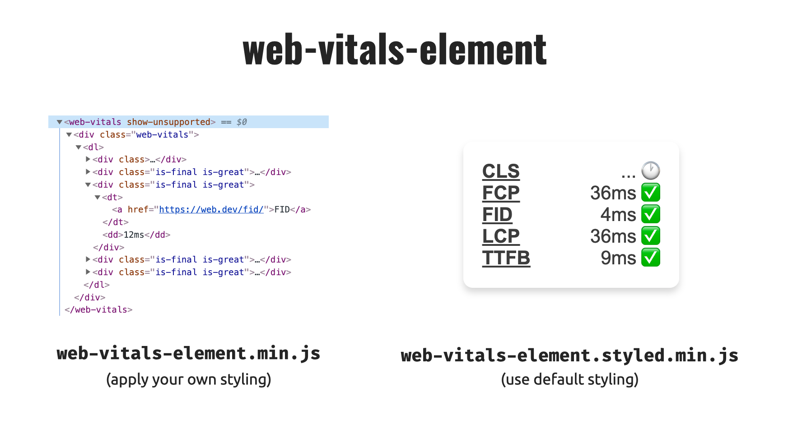

# web-vitals-element

> Bring [web vitals](https://github.com/GoogleChrome/web-vitals) quickly into your page using custom elements



[See it in action on CodePen](https://codepen.io/stefanjudis/pen/wvGzvWx).

## Basic usage

```html
<!-- Include the custom element script -->

<!-- Unstyled (installed locally) -->
<script src="node_modules/web-vitals-element/dist/web-vitals-element.min.js"></script>
<!-- Unstyled from unpkg.com -->
<script src="https://unpkg.com/web-vitals-element@1.0.1/dist/web-vitals-element.min.js"></script>

<!-- Styled (installed locally) -->
<script src="node_modules/web-vitals-element/dist/web-vitals-element.styled.min.js"></script>
<!-- Styled from unpkg.com -->
<script src="https://unpkg.com/web-vitals-element@1.0.1/dist/web-vitals-element.styled.min.js"></script>
```

_The element does not render shadow DOM. You can style it like any other element in your HTML page._

After loading the element script, use the `web-vitals` element in your HTML.

```html
<!-- Basic usage -->
<web-vitals></web-vitals>

<!-- Define the metrics you care about -->
<web-vitals cls fcp fid lcp ttfb></web-vitals>

<!-- Show message about not support metrics -->
<web-vitals show-unsupported></web-vitals>
```

Currently supported metrics: `cls`, `fcp`, `fid`, `lcp`, `ttfb`. Read more about these in [the web-vitals documentation](https://github.com/GoogleChrome/web-vitals).

## Contributing

*I'd love to see more themes for the web vitals element box – the fancier the better!* If you're interested in contributing some fancy looks, please [open an issue](https://github.com/stefanjudis/web-vitals-element/issues/new).

## Code of conduct

This project underlies [a code of conduct](./CODE-OF-CONDUCT.md).

## License

This project is released under [MIT license](./LICENSE).
